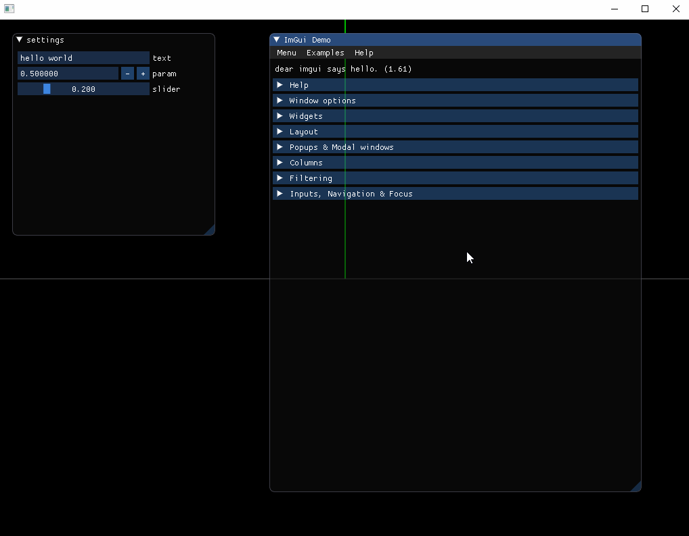

### openframeworks 0.10.0 Lite Integration
simple, easy to update imgui

## demo

## dear imgui versions
v1.61

## platform
only tested windows 10, vs 2017

### integration notes

file imgui_impl_glfw_gl3.cpp
- #include <GL/gl3w.h>
+ #include <gl/glew.h>

rename
    IMGUI_API void        ImGui_ImplGlfw_MouseButtonCallback(GLFWwindow* window, int button, int action, int mods);
    IMGUI_API void        ImGui_ImplGlfw_ScrollCallback(GLFWwindow* window, double xoffset, double yoffset);
    IMGUI_API void        ImGui_ImplGlfw_KeyCallback(GLFWwindow* window, int key, int scancode, int action, int mods);
    IMGUI_API void        ImGui_ImplGlfw_CharCallback(GLFWwindow* window, unsigned int c);
to 
    IMGUI_API void        ImGui_ImplGlfw_MouseButtonCallback_GL3(GLFWwindow* window, int button, int action, int mods);
    IMGUI_API void        ImGui_ImplGlfw_ScrollCallback_GL3(GLFWwindow* window, double xoffset, double yoffset);
    IMGUI_API void        ImGui_ImplGlfw_KeyCallback_GL3(GLFWwindow* window, int key, int scancode, int action, int mods);
    IMGUI_API void        ImGui_ImplGlfw_CharCallback_GL3(GLFWwindow* window, unsigned int c);

